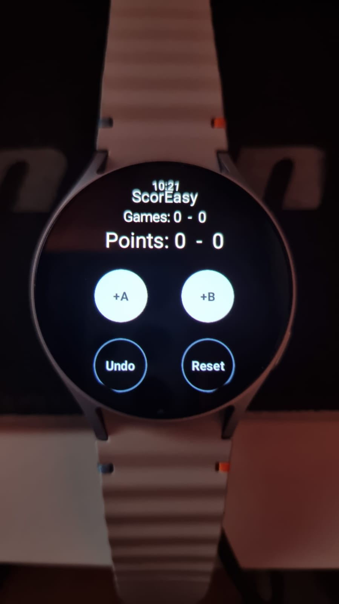

## ScorEasy

### Scoreboard app for Padel and Tennis games on smartwatch (Wear OS)

This project was created with the goal of: 

- learning how to develop smartwatch applications
- creating a solid foundation to evolve the scoreboard (15/30/40, games, tie-break, etc.)

### Main files

- **MainActivity.kt** - Entry point of the app
- **domain/MatchState.kt** - Logic of the Score
- **ui/ScoreScreen.kt** - Interface
- **AndroidManifest** - Android config file

### How to run

In your smartwatch follow these steps:

```
Configurations -> Developer options -> Wireless debugging (Turn on this)
```

You have to be connect the same Wi-fi your computer

```
adb connect IP:PORT
```

After paired and connected, look if your smartwatch was identified as a device and click "play" to run

<p align="center">
  
</p>

